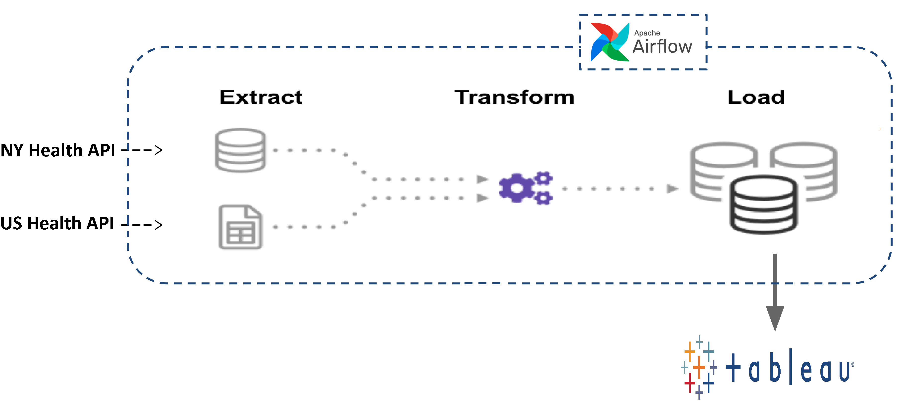
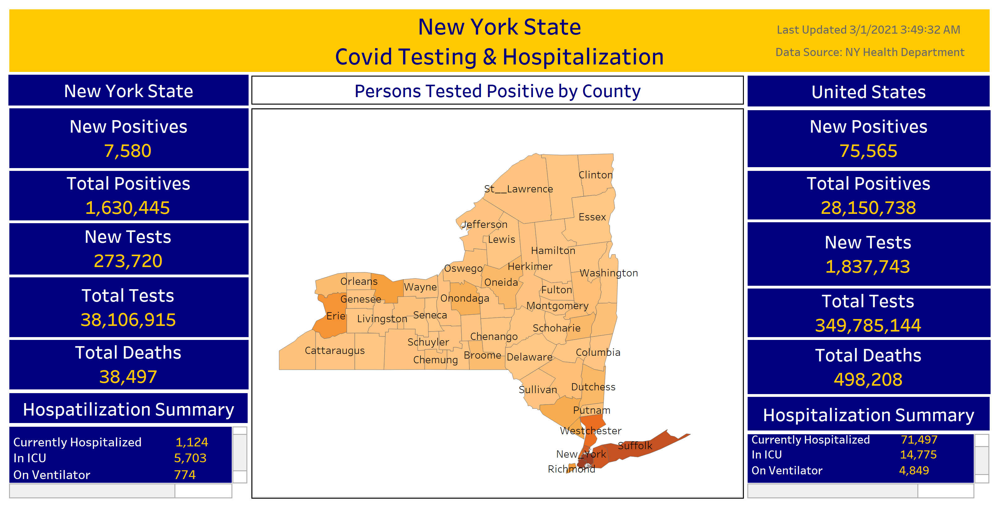

# New York State Covid Testing & Hospitalization Dashboard 

## Table of Contents

1. [Requirements](README.md#requirements)
2. [Data Description](README.md#data-description)
3. [Data Pipeline](README.md#data-pipeline)
4. [Dashboard](README.md#dashboard)

### Requirements

Follow these steps to install the necessary tools.
1. Install Docker Community Edition (CE) on workstation.
2. Install Docker Compose v1.27.0 and newer on workstation.
3. Download the docker-compose.yml file from Apache Airflow official website.

To start all the services, run the below command in the terminal
-   docker-compose -f docker-compose-LocalExecutor.yml up --detach --build

### Data Description

The dataset contains Covid Testing and Hospitalization data for the state of New york and all other states combined. For the state of Newyork, testing data is available from the county level. The data is extracted from the public health API's and updated daily. The below are the fields in the dataset:
-   test_date
-   New_Positives
-   Cumulative_Positives
-   New_Tests
-   Cumulative_Tests
-   Load_Date
-   Total_Deaths
-   Currently_Hospitalized
-   In_ICU
-   On_Ventilator

### Data Pipeline

### Dashboard

I've built an interactive dashboard using Tableau to display Covid Testing and Hospitalization data which will be updated every day.

### Contact Information

- [gorantla.a@northeastern.edu](gorantla.a@northeastern.edu)